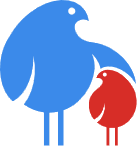

#### 15 Νοεμβρίου 2017

## Ομάδα Ανάπτυξης Εφαρμογών Stack Over Flowers

### Συντάκτες:  Βάρδας Εμμανουήλ Βιώνη Αλεξάνδρα Βουτσινάς Ιωάννης Καριώτης Ορέστης Μητρόπουλος Κωνσταντίνος-Χρήστος Πλάκας Ιωάννης
 

# Kidspiration  

# Ανάλυσης Απαιτήσεων & Τεχνικές Προδιαγραφές
 

## Ανάλυση Απαιτήσεων
 

## Στόχος Πλατφόρμας
Η πλατφόρμα ξεκίνησε τη λειτουργία της το 2017 και αποτελεί μια διαδικτυακή κοινότητα όπου γονείς μπορούν να επιλέξουν δραστηριότητες για τα παιδιά τους μέσα από μια μεγάλη γκάμα καταχωρήσεων από παρόχους παιδικών δραστηριοτήτων. Μέσω αυτής θα μπορούν γονείς να έχουν εποπτεία των δραστηριοτήτων για παιδιά που διοργανώνονται σε κάθε περιοχή στο σύνολό τους, αλλά και να αναζητούν με συγκεκριμένα κριτήρια δραστηριότητες και εκδηλώσεις για τα παιδιά τους, όπως και να κάνουν κράτηση γι' αυτές που επιθυμούν, άμεσα, γρήγορα και με ασφάλεια. Παράλληλα, επιθυμούμε η πλατφόρμα μας να είναι οικονομικά βιώσιμη και να μας αποφέρει κέρδη, που θα συμβάλλουν στην επιβίωση και επέκτασή της σε βάθος χρόνου. Για το σκοπό αυτό, θα προσπαθήσουμε να παρέχουμε κίνητρα στους γονείς για να χρησιμοποιήσουν την πλατφόρμα μας, όσο και στους παρόχους υπηρεσιών για να προβάλλουν τις δραστηριότητες τους μέσω αυτής, μεριμνώντας ώστε να επιτυγχάνεται κάθε φορά αμοιβαίο όφελος από τη λειτουργία της.

 

## Κατηγορίες Χρηστών
Θα υποστηρίζονται οι παρακάτω ρόλοι χρηστών:

* **Ανώνυμος Χρήστης**
 >Χρήστης που δεν είναι εγγεγραμμένος ή συνδεδεμένος στην πλατφόρμα. Κάθε ανώνυμος χρήστης θα έχει την δυνατότητα να δει την αρχική σελίδα της πλατφόρμας, να διαβάσει τις βασικές πληροφορίες γι' αυτή και να αναζητήσει δραστηριότητες. Δεν θα μπορεί να ανεβάσει ο ίδιος μια δικιά του ή να κάνει κάποια κράτηση. Θα μπορεί να κάνει εγγραφή στην πλατφόρμα είτε ως γονέας είτε ως πάροχος, ανάλογα με τη χρήση που θέλει να κάνει στην πλατφόρμα. 
* **Γονέας**
 >Χρήστης που συνδέεται ως γονέας, ώστε να αναζητήσει και να κάνει κράτηση σε δραστηριότητες. Ο χρήστης Γονέας πρόκειται για έναν εγγεγραμμένο στην πλατφόρμα χρήστη. Σε κάθε συνεδρία θα συνδέεται και θα αναγνωρίζεται από την πλατφόρμα, ώστε να μπορεί να την χρησιμοποιήσει σύμφωνα με τις λειτουργίες του Γονέα. Κάθε γονέας θα μπορεί να αναζητά και να κάνει κρατήσεις για εκδηλώσεις. Θα μπορεί να τροποποιεί τις πληροφορίες προφίλ του και να αγοράζει πόντους για το ηλεκτρονικό πορτοφόλι του.
* **Πάροχος Υπηρεσιών**
 >Χρήστης ο οποίος θέτει έναν αριθμό εκδηλώσεων και δραστηριοτήτων ώστε να προβληθούν από την πλατφόρμα. Όπως και με τον Γονέα, έτσι και ο χρήστης Πάροχος θα συνδέεται στην πλατφόρμα. Ο Πάροχος θα μπορεί να εισάγει καινούριες δραστηριότητες προς προβολή. Θα έχει την δυνατότητα να πλοηγείται στην πλατφόρμα βλέποντας εκδηλώσεις, όμως δεν θα έχει ηλεκτρονικό πορτοφόλι και δεν θα μπορεί να κάνει κρατήσεις. Τέλος θα μπορεί να επεξεργαστεί το προφίλ του με πληροφορίες της επιχείρησης που εκπροσωπεί, να βλέπει την πληρότητα κάθε μιας εκ των δραστηριοτήτων που έχει αναρτήσει, καθώς και μηνιαία reports με τα εισιτήρια που πωλήθηκαν και τα αντίστοιχα έσοδα ανά μήνα.
* **Διαχειριστής**
 >Χρήστης με αυξημένες αρμοδιότητες για τη διαχείριση της πλατφόρμας και των χρηστών που συνδέονται σε αυτήν. Θα υπάρχει ένα μικρό σύνολο διαχειριστών πλατφόρμας οι οποίοι θα μπορούν να τροποποιήσουν τους ρόλους και τα δικαιώματα των Γονέων και των Παρόχων, ή και να κλειδώσουν τους λογαριασμούς τους. Μπορούν επιπλέον να επαναφέρουν τον κωδικό πρόσβασης ενός χρήστη, έπειτα από απαίτησή του. Επίσης, μπορούν να πλοηγούνται στην πλατφόρμα, χωρίς όμως τη δυνατότητα να κάνουν κρατήσεις ή να ανεβάζουν δραστηριότητες. Επίσης, θα έχουν πρόσβαση σε ειδικές καρτέλες σχετικές με την εποπτεία της λειτουργίας της πλατφόρμας και στατιστικά για τη χρήση της.
  

## Επιχειρησιακά Ζητήματα

### Προσέλκυση Χρηστών
Για την προσέλκυση τόσο των γονέων, όσο και των παρόχων, βασιζόμαστε κυρίως στην πρώιμη επιτυχία της πλατφόρμας. Θεωρούμε μια πλατφόρμα εύκολη και απλή στην χρήση, αλλά ταυτόχρονα αξιόπιστη, χωρίς αρχική ή πάγια οικονομική επιβάρυνση, προσιτή από όλους, που μπορεί να πείσει όλο και περισσότερο κόσμο για την χρησιμότητά της. Έχοντας ως αρχική παροχή ένα σύνολο δραστηριοτήτων σε διάφορους τομείς από συμφωνίες με παρόχους δραστηριοτήτων, στοχεύουμε στο να καταφέρουμε να διαφημίσουμε διαδικτυακά σε κατάλληλα sites/forums την εταιρεία, ώστε να αποκτήσουμε την αρχική βάση χρηστών. Παράλληλα, πριμοδοτούμε την αγορά πόντων συναλλαγής, καθώς και την σταθερή επιλογή και χρήση της πλατφόρμας μας, ως περαιτέρω κίνητρο προσέλκυσης χρηστών. Επίσης, στην αρχική σελίδα της πλατφόρμας παρουσιάζονται οι πιο πρόσφατα ανεβασμένες εκδηλώσεις, γεγονός που ευνοεί τους νέους και ενεργούς παρόχους, καθώς χαίρουν μίας ήπιας μορφής διαφήμισης.

### Πόντοι και Ηλεκτρονικό Πορτοφόλι
Οι χρήστες Γονείς θα διαθέτουν ένα ηλεκτρονικό πορτοφόλι πόντων. Θα μπορούν να φορτώσουν το πορτοφόλι αγοράζοντας πόντους με την χρήση πιστωτικών, χρεωστικών και προπληρωμένων καρτών, με συγκεκριμένα πακέτα αγοράς πόντων, όπως φαίνεται στον παρακάτω πίνακα. Με αυτούς τους πόντους θα μπορούν να αγοράσουν εισιτήρια για τις όποιες δραστηριότητες. Επίσης, κάθε φορά που ένας Γονέας ξοδεύει συνολικά 300€ για αγορές στην πλατφόρμα μας, τον ανταμοίβουμε με 1000 πόντους συναλλαγών.

| Τιμή Πακέτου  | Πόντοι        |
| ------------- |---------------|
| 5€ | 500 |
| 10€ | 1025 |
| 20€ | 2100 |
| 50€ | 5300 |

### Αγορά και Πολιτική Εισιτηρίων
Οι Γονείς μπορούν να αγοράζουν με την χρήση των πόντων και μόνο αυτών, εισιτήρια για εκδηλώσεις που επιθυμούν. Κάθε εισιτήριο είναι ατομικό και μεμονωμένο, δεν υπάρχουν πακέτα εισιτηρίων ή ειδικά εισιτήρια πολλαπλών χρήσεων. Ωστόσο, ο Πάροχος είναι ελεύθερος να προβάλλει συνδρομητικές δραστηριότητες με την μορφή μοναδικής εκδήλωσης και, άρα, η συνδρομή να αγοραστεί ως μεμονωμένο εισιτήριο.

### Χρεώσεις Χρηστών
Η υπηρεσία μας παρέχεται τόσο στους γονείς, όσο και στους παρόχους παιδικών εκδηλώσεων χωρίς κάποια πάγια πληρωμή ή μηνιαία συνδρομή για τη χρήση της πλατφόρμας. Επίσης δεν υπάρχει υποχρεωτικό σταθερό κόστος ανά ανάρτηση εκδήλωσης για τον πάροχο, ή σταθερό κόστος ανά κράτηση εισιτηρίου για τον γονέα. Οι επιλογές αυτές γίνονται ώστε να υπάρχει ευνοϊκό περιβάλλον για την όσο το δυνατόν μεγαλύτερη ανάπτυξη και χρήση της πλατφόρμας, τόσο από παρόχους που θέλουν να προβάλλουν τις εκδηλώσεις τους, όσο και από γονείς που αναζητούν ενδιαφέρουσες δραστηριότητες για τα παιδιά τους. 

### Κέρδος Πλατφόρμας
Η πλατφόρμα μας βγάζει κέρδος από προμήθεια της τάξης του 10% της τιμής του εισιτηρίου, για κάθε εισιτήριο που έχει κοπεί για μια δραστηριότητα. Η προμήθεια ουσιαστικά κατακρατάται από τα χρήματα που η πλατφόρμα θα αποδώσει στον πάροχο της δραστηριότητας μετά το πέρας αυτής, με βάση τα εισιτήρια που έχουν εκδοθεί και πωληθεί από την πλατφόρμα μας για την εν λόγω δραστηριότητα. Κατά την εγγραφή παρόχου στην πλατφόρμα, μέσα στους όρους του συμφωνητικού, καταγράφεται ρητά πως ο πάροχος συμφωνεί με την κράτηση 10% η οποία ουσιαστικά παρέχεται ως αντάλλαγμα για τις υπηρεσίες προβολής της δραστηριότητας από την πλατφόρμα και δημοσιοποίησής της δραστηριότητας μέσω της πλατφόρμας στο ευρύ κοινό. Παράλληλα, ο πάροχος υποχρεούται να μη διαθέτει την ίδια δραστηριότητα σε χαμηλότερη τιμή σε άλλες πλατφόρμες ή εκτός πλατφόρμας. Οι πάροχοι θα πληρώνονται στο τέλος κάθε μέρας, για το σύνολο των εκδηλώσεων που πραγματοποιήθηκαν τη δεδομένη ημέρα, μέσω κατάθεσης στον τραπεζικό λογαριασμό που παρείχαν κατά την εγγραφή τους.

 

## Λειτουργικές Απαιτήσεις Πλατφόρμας
Οι λειτουργικές απαιτήσεις της πλατφόρμας μας σχετίζονται με τις επιθυμητές υπηρεσίες που θα παρέχει η πλατφόρμα και με τον τρόπο που αυτές παρουσιάζονται στους χρήστες και χρησιμοποιούνται από αυτούς, ανάλογα με την ιδιότητά τους.
 
### Αρχική Σελίδα
Η επίσκεψη στην ιστοσελίδα μας ξεκινά από την Αρχική Σελίδα (Homepage), όπου ο χρήστης θα μπορεί να δει ένα μέρος των διαθέσιμων εκδήλωσεων, τις πιο πρόσφατα ανεβασμένες. Επίσης, θα υπάρχει ένα μικρό κείμενο-λεζάντα που θα περιγράφει με συνοπτικό και ελκυστικό τρόπο την υπηρεσία που προσφέρουμε. Ο χρήστης θα μπορεί να μεταβεί σε διαφορετικές σελίδες ώστε να εγγραφεί ως Γονέας ή ως Πάροχος, ή να συνδεθεί με τον ήδη υπάρχοντα λογαριασμό του -εάν επισκέπτεται τη σελίδα ως Ανώνυμος χρήστης- ή για να δει το προφίλ του με τη δυνατότητα να το επεξεργαστεί. Στην Αρχική Σελίδα θα δίνεται επίσης η δυνατότητα μέσω ενός πλαισίου αναζήτησης ο χρήστης να ξεκινήσει μια αναζήτηση, ή να μεταβεί στη σελίδα Αναζήτησης όπου μπορεί να εκτελέσει μια πλήρη αναζήτηση, επιλέγοντας και ρυθμίζοντας κριτήρια για να αναζητήσει δραστηριότητες με βάση τις προτιμήσεις του.
       
### Κριτήρια Αναζήτησης
Τα κριτήρια αναζήτησης που θα συμπεριλαμβάνονται στο σύστημά μας είναι:
- αναζήτηση ελεύθερου κειμένου
- με βάση την κατηγορία της δραστηριότητας
- με βάση τις ηλικίες στις οποίες η δραστηριότητα απευθύνεται
- με βάση την απόσταση του χώρου διεξαγωγής της δραστηριότητας από τη θέση του γονέα
- με βάση το κόστος του εισιτηρίου
- με βάση την ημερομηνία διεξαγωγής

### Κατηγορίες Δραστηριοτήτων
Οι δραστηριότητες που προβάλλονται στην πλατφόρμα καλύπτουν όλο το φάσμα των δραστηριοτήτων που απευθύνονται σε παιδιά, και πιο συγκεκριμένα μπορούν να χωριστούν στις ακόλουθες κατηγορίες:
- Παραστάσεις (εδώ εντάσσονται εκδηλώσεις σχετικές με κινηματογράφο, θέατρο, χορό, μουσική, κουκλοθέατρο κ.ά.)
- Μουσεία (επισκέψεις, δραστηριότητες και εκδηλώσεις σε μουσεία)
- Αθλητισμός (γνωριμία και προπόνησεις σε διάφορα αθλήματα, μαθήματα χορού, πολεμικές τέχνες κ.ά.)
- Παιχνίδι (παιδότοποι, θεματικά πάρκα αναψυχής, νεροτσουλήθρες, εκδηλώσεις σχετικές με τα παιχνίδια)
- Επιστήμη & Περιβάλλον (ρομποτική, περιβαλλοντική αγωγή, επιστημονικές εκθέσεις και εκδηλώσεις για παιδιά)
- Μαθήματα (μαθήματα ζωγραφικής, μαθήματα μουσικής, μουσικοκινητική αγωγή κ.ά.)

Τα άνωθεν θα λειτουργήσουν και ως ετικέτες κατηγοριοποίησης για τις διάφορες δραστηριότητες.

### Δυνατότητες Χρηστών
#### Ανώνυμοι Χρήστες
Όταν ένας χρήστης μεταβαίνει στην ιστοσελίδα χωρίς να είναι συνδεδεμένος, εμφανίζεται η αρχική σελίδα όπως περιγράφηκε προηγουμένως. Οι δυνατότητες που έχει στη συνέχεια, συνεπώς, είναι: Είτε να συμπληρώσει το πεδίο αναζήτησης για να αναζητήσει δραστηριότητες -χωρίς όμως να μπορεί να κάνει κράτηση-, είτε να συνδεθεί στο λογαριασμό του, ή αν δεν έχει λογαριασμό, να εγγραφεί ως Γονέας ή ως Πάροχος, μεταβαίνονται στην αντίστοιχη σελίδα.

Στην σελίδα εγγραφής Γονέα, μέσω κατάλληλης φόρμας, η οποία θα περιλαμβάνει τα πεδία: Όνομα, Επώνυμο, Τηλέφωνο, E-mail, Username, Password, θα μπορεί να κάνει την εγγραφή του και έπειτα να συνδεθεί στην πλατφόρμα για να συνεχίσει. Αντίστοιχα, στη σελίδα εγγραφής Παρόχου, μέσω κατάλληλης φόρμας, η οποία θα περιλαμβάνει τα πεδία: Όνομα, Επώνυμο, Ονομασία Επιχείρησης, Τηλέφωνο, E-mail, Αριθμός Τραπεζικού Λογαριασμού, Username, Password, θα μπορεί να κάνει την εγγραφή του ως Πάροχος. Στη φόρμα εγγραφής Παρόχου ζητείται η υποβολή μιας φωτογραφίας αντιπροσωπευτικής της επιχείρησης του Παρόχου. Επίσης, ζητείται η υποβολή ως συνημμένου ενός Εγγράφου Πιστοποίησης (π.χ. καταστατικό επιχείρησης, φορολογική δήλωση, άδεια λειτουργίας), το οποίο ο Πάροχος θα υποβάλει στο σύστημα και θα αξιολογείται από φυσικό πρόσωπο της πλατφόρμας μας. Πρόκειται για μια διαδικασία η οποία θεωρούμε πως δεν εμπίπτει στην εμβέλεια του ηλεκτρονικού μας συστήματος και εισάγεται για να διασφαλίσουμε την αξιοπιστία των Παρόχων δραστηριοτήτων στην πλατφόρμα μας. Επίσης πρέπει να αναφερθεί πως και στις δύο σελίδες αυτές θα εμπεριέχονται και οι Όροι Χρήσης της πλατφόρμας, στους οποίους θα αναγράφονται ρητά οι κανονισμοί χρήσης της σελίδας, τα δικαιώματα και οι υποχρεώσεις του κάθε χρήστη.

Αφού ένας Γονέας εγγραφεί, μπορεί αμέσως να συνδεθεί στο λογαριασμό του και να χρησιμοποιήσει την ιστοσελίδα μας. Αντίθετα, ένας Πάροχος αφού εγγραφεί πρέπει να περιμένει ώστε να γίνει ο έλεγχος των εγγράφων που κατέθεσε και να εγκριθεί χειροκίνητα ο λογαριασμός του για να συνδεθεί και να αναρτήσει δραστηριότητες. Τέλος, στους Ανώνυμους Χρήστες -όπως και στους υπόλοιπους συνδεδεμένους χρήστες- δίνεται πρόσβαση στις σελίδες "Σχετικά με εμάς", "Συχνες Ερωτήσεις (FAQ)", "Όροι Χρήσης", μέσω των οποίων μπορούν να ενημερωθούν περαιτέρω σχετικά με την πλατφόρμα μας, καθώς και στη σελίδα "Επικοινωνία" όπου μπορούν να βρουν όλα τα απαραίτητα στοιχεία για επικοινωνία με τους διαχειριστές της πλατφόρμας.

#### Γονείς
Ο χρήστης Γονέας μπορεί από την Αρχική Σελίδα να εκτελέσει αναζήτηση δραστηριοτήτων συμπληρώνοντας το πλαίσιο αναζήτησης που υπάρχει σε αυτή. Έτσι μεταβαίνει στη σελίδα Αναζήτησης, όπου μπορεί να εκτελέσει πλήρη αναζήτηση με τα κριτήρια που επιθυμεί, ρυθμίζοντας τα κατάλληλα πεδία που αντιστοιχούν σε κάθε κριτήριο. Μόλις εκτελεστεί η αναζήτηση εμφανίζονται όλες οι δραστηριότητες που πληρούν τα κριτήρια που έθεσε, με συνοπτικές πληροφορίες. Δηλαδή, για κάθε δραστηριότητα εμφανίζεται ο τίτλος της, μια εικόνα, μια σύντομη περιγραφή, η ημερομηνία και η ώρα διεξαγωγής της, το κόστος του εισιτηρίου και η κατηγορία της δραστηριότητας. Επίσης, στη σελίδα αυτή, εμφανίζεται χάρτης με τις δραστηριότητες που ανήκουν στην υπό αναζήτηση περιοχή.

Ο Γονέας, για να δει περισσότερες πληροφορίες για μια δραστηριότητα, μεταβαίνει στη σελίδα της δραστηριότητας, όπου υπάρχουν επιπλέον όλες οι φωτογραφίες που έχει διαθέσει ο Πάροχος για τη δραστηριότητα αυτή, καθώς και αναλυτική περιγραφή της και σύνδεσμος για το προφίλ του Παρόχου που τη διοργανώνει. Στη σελίδα αναγράφεται εμφανώς το κόστος του εισιτηρίου σε πόντους και οι διαθέσιμες θέσεις, ενώ δίνεται δυνατότητα για άμεση αγορά ενός ή περισσότερων εισιτηρίων. Ο Γονέας από τη σελίδα της δραστηριότητας μπορεί: Να κάνει αγορά εισιτηρίων, να δει το προφίλ του Παρόχου, ή να επιστρέψει στη σελίδα με τα αποτελέσματα αναζήτησης. Σε περίπτωση που προσπαθήσει να κάνει αγορά εισιτηρίων, χρειάζεται απλά να συμπληρώσει το πλήθος των εισιτηρίων που θέλει. Εάν έχει τους απαραίτητους πόντους για την αγορά, εμφανίζεται μήνυμα επιβεβαίωσης της αγοράς και έπειτα αφαιρούνται οι αντίστοιχοι πόντοι. Εάν δεν έχει τους απαραίτητους πόντους, εμφανίζεται παρότρυνση για μετάβαση στη σελίδα αγοράς πόντων. Μετά την αγορά, τα στοιχεία του εισιτηρίου και της δραστηριότητας την οποία αφορά, εμφανίζονται στο ιδιωτικό πάνελ του Γονέα, όπως θα αναφερθεί στη συνέχεια.

Στη σελίδα προφίλ του Παρόχου, ο Γονέας μπορεί να βρει τα στοιχεία του και όλες τις ενεργές δραστηριότητες που έχει ανεβάσει ο συγκεκριμένος Πάροχος. Όταν ένας χρήστης είναι συνδεδεμένος ως Γονέας, του είναι πάντα εμφανές το σύνολο των διαθέσιμων πόντων που έχει στο ηλεκτρονικό του πορτοφόλι, καθώς και η δυνατότητα μετάβασης στο προφίλ του και στη σελίδα αγοράς πόντων. Το προφίλ του Γονέα είναι ιδιωτικό και σε αυτό εμφανίζονται τα στοιχεία του προφίλ του, μια λίστα των τρεχόντων εισιτηρίων που κατέχει, συμπεριλαμβανομένων και των μοναδικών κωδικών εισιτηρίων που τα χαρακτηρίζουν, με δυνατότητα μετάβασης στις αντίστοιχες δραστηριότητες, καθώς και ιστορικό των εισιτηρίων που έχει αγοράσει τον τελευταίο χρόνο για δραστηριότητες που έχουν ήδη πραγματοποιηθεί. 

#### Πάροχοι
Ο χρήστης Πάροχος μπορεί από την αρχική σελίδα να πλοηγηθεί στην ιστοσελίδα και να αναζητήσει δραστηριότητες, όπως ακριβώς και ο Γονέας. Στον πάροχο δεν δίνεται η δυνατότητα αγοράς εισιτηρίων, κατ'επέκταση δεν έχει και ηλεκτρονικό πορτοφόλι. Ο Πάροχος μπορεί ανά πάσα στιγμή να μεταβεί στο προφίλ του και στη σελίδα προσθήκης νέας δραστηριότητας στην πλατφόρμα. Στη δεύτερη περίπτωση θα μεταβαίνει σε νέα σελίδα όπου μέσω φόρμας θα εισάγει τον τίτλο και την περιγραφή της δραστηριότητας, τον αριθμό των εισιτηρίων που επιθυμεί να διατεθούν μέσω της πλατφόρμας μας και την τιμή πώλησης κάθε εισιτηρίου. Επίσης, θα συμπληρώνει πεδία που αφορούν στην κατηγορία της νέας δραστηριότητας, στο εύρος των ηλικιών στις οποίες απευθύνεται, στην ημερομηνία, στην ώρα και στην τοποθεσία διεξαγωγής της. Ακόμα, θα μπορεί να υποβάλλει φωτογραφίες αντιπροσωπευτικές της δραστηριότητας και του χώρου όπου θα γίνει. Όταν θα ολοκληρώνεται η παραπάνω διαδικασία, ο Πάροχος θα υποβάλλει τη φόρμα στο σύστημα και η δραστηριότητα θα αναμένει έγκριση από κάποιον διαχειριστή. Αφού τη λάβει, θα δημοσιεύεται και θα εμφανίζεται στην πλατφόρμα, μαζί με τα διαθέσιμα γι' αυτή εισιτήρια. Στις προαναφερθείσες φωτογραφίες θα προστίθεται ένα υδατογράφημα, το οποίο κατοχυρώνει τα δικαιώματα πνευματικής ιδιοκτησίας.

Όσον αφορά στο προφίλ του Παρόχου, θα χωρίζεται σε δύο μέρη. Κατ'αρχάς, κάθε Πάροχος θα έχει μια σελίδα προφίλ, η οποία θα είναι ορατή σε όλους τους συνδεδεμένους στο σύστημα -μη ανώνυμους- χρήστες. Στη σελίδα αυτή, θα φαίνονται τα στοιχεία του Παρόχου και μία φωτογραφία του. Επίσης, θα εμφανίζονται όλες οι δραστηριότητες που έχει ανεβάσει ο Πάροχος αυτός και είναι ενεργές, έτσι ώστε κάποιος Γονέας να μπορεί να βρει συγκεντρωμένες όλες τις δραστηριότητες που διοργανώνει ο εν λόγω Πάροχος. Το δεύτερο μέρος του προφίλ αφορά σε ένα πάνελ ελέγχου που θα έχει πρόσβαση μόνο αυτός. Σε αυτό θα εμφανίζονται οι δραστηριότητες που έχει ο ίδιος υποβάλλει στο σύστημα και η εξέλιξη της διαδικασίας προπώλησης εισιτηρίων, οι εκδηλώσεις που αναμένουν την έγκριση κάποιου διαχειριστή με την αντίστοιχη ένδειξη, καθώς και οι δραστηριότητας που έχει υποβάλλει και έχουν ήδη πραγματοποιηθεί. Τέλος θα υπάρχουν διαθέσιμα μηνιαία reports τα οποία θα παρουσιάζουν πόσα εισιτήρια πωλήθηκαν για τις εκδηλώσεις που έχει υποβάλλει ο Πάροχος οι οποίες πραγματοποιήθηκαν αυτό το μήνα, καθώς και τους αντίστοιχους πόντους και τα αντίστοιχα αλλά και τα συνολικά έσοδα του Παρόχου.

#### Διαχειριστές
Οι Διαχειριστές θα συνδέονται στο σύστημα μέσα από μια φόρμα σύνδεσης η οποία δεν θα είναι διαθέσιμη από την αρχική σελίδα, αλλά από σελίδα που γνωρίζουν μόνο οι ίδιοι για λόγους ασφαλείας. Αφού συνδεθούν, θα αναγνωρίζονται ως συνδεδεμένοι χρήστες στην ιστοσελίδα και θα μπορούν να περιηγηθούν κανονικά, να κάνουν αναζήτηση δραστηριοτήτων, αλλά όχι να αγοράσουν πόντους και εισιτήρια, ούτε να υποβάλλουν καινούριες δραστηριότητες στο σύστημα. Οι λόγοι για τους οποίους μπορούν να περιηγθούν στην πλατφόρμα είναι καθαρά πρακτικοί, δηλαδή για να μπορούν να εποπτεύουν ότι όλα λειτουργούν και εμφανίζονται όπως πρέπει για τους χρήστες της ιστοσελίδας, αλλά δεν είναι χρηστικοί, δηλαδή δεν είναι χρήστες των υπηρεσιών που προσφέρει η πλατφόρμα. Το έργο των Διαχειριστών λαμβάνει χώρα στον Πίνακα Ελέγχου, ένα σύνολο σελίδων που είναι προσβάσιμο μόνο για τους Διαχειριστές και στο οποίο είναι διαθέσιμα όλα τα απαραίτητα για τη δουλειά τους εργαλεία. Στον Πίνακα Ελέγχου υπάρχουν οι εξής σελίδες:
- Μία λίστα Γονέων, όπου ο Διαχειριστής μπορεί να δει όλους τους λογαριασμούς των εγγεγραμμένων Γονέων με τα στοιχεία τους και τους διαθέσιμους πόντους τους, να αφαιρέσει το δικαίωμα πρόσβασης στον λογαριασμό του. Αντίστοιχα, μπορεί να επαναφέρει τα δικαιώματα σε έναν χρήστη Γονέα. Επίσης, έχει τη δυνατότητα επαναφοράς του κωδικού πρόσβασης ενός Γονέα, εφόσον αυτό ζητηθεί.
- Μία λίστα Παρόχων, όπου ο Διαχειριστής μπορεί να δει όλους τους λογαριασμούς των εγγεγραμμένων Παρόχων με τα στοιχεία τους. Μπορεί να αφαιρέσει δικαιώματα πρόσβασης στον λογαριασμό και ανάρτησης νέων εκδηλώσεων, ή αντίστοιχα να τα επαναφέρει. Επίσης, έχει τη δυνατότητα επαναφοράς του κωδικού πρόσβασης ενός Παρόχου, εφόσον αυτό ζητηθεί.
- Μία σελίδα στην οποία υπάρχει λίστα των Παρόχων που αναμένουν έγκριση της εγγραφής τους (έπειτα από επιθεώρηση των στοιχείων τους) και μία αντίστοιχη για την έγκριση των υποβαλλόμενων δραστηριοτήτων.
- Στατιστικά στοιχεία χρήσης: Αριθμός χρηστών, έσοδα και έξοδα της πλατφόρμας σε μηνιαία βάση, ώστε να μπορεί να γίνει επιχειρησιακός έλεγχος στην πλατφόρμα και να παρακολουθείται η λειτουργία της.

### Καθολικές Απαιτήσεις
- Κάθε χρήστης και διαχειριστής θα μπορεί να αποσυνδέεται από την πλατφόρμα όποτε το επιθυμεί και να επανασυνδέεται την επόμενη φορά που θα θέλει να τη χρησιμοποιήσει. Παράλληλα, θα του είναι πάντα προσβάσιμοι οι Όροι Χρήσης της πλατφόρμας, καθώς και μία σελίδα Συχνών Ερωτήσεων (FAQ).
- Η πλατφόρμα εγγυάται την ασφαλή ανταλλαγή και συνεπή διατήρηση των δεδομένων του χρήστη.
- Η πλατφόρμα θα είναι εύχρηστη και λειτουργική, οι λειτουργίες θα είναι ομοίως προσβάσιμες και λειτουργικές, ανεξαρτήτως της συσκευής του χρήστη (π.χ. υπολογιστής, tablet, κινητό). Ωστόσο, ο τρόπος εμφάνισης των λειτουργιών θα εξαρτάται από την εκάστοτε συσκευή (responsive design).

### Υποστήριξη - Καταγγελίες
Οι χρήστες της πλατφόρμας μας μπορούν να επικοινωνήσουν ανά πάσα στιγμή με τους διαχειριστές, για ερωτήσεις, απορίες, υποστήριξη ή καταγγελία, μέσω των στοιχείων επικοινωνίας που δίνονται στη σελίδα "Επικοινωνία". Η περαιτέρω επικοινωνία μεταξύ διαχειριστή και χρήση θα γίνεται μέσω e-mail.

 

## Εμβέλεια - Περιορισμοί - Παραδοχές
* Η ευθύνη για την ασφάλεια των παιδιών κατά την διάρκεια της εκάστοτε δραστηριότητας βαραίνει τον πάροχο αυτής. Αυτό αναφέρεται ρητά στους όρους χρήσης που υποχρεούνται να διαβάσουν και να αποδεχθούν κατά την εγγραφή τους Γονείς και Πάροχοι.
* Η πλατφόρμα θα απαιτεί την αποστολή επαρκών δικαιολογητικών σχετικά με τη νόμιμη επιχειρησιακή υπόσταση του παρόχου (π.χ. άδεια λειτουργίας). Τα εν λόγω δικαιολογητικά θα ελέγχονται από τους Διαχειριστές της πλατφόρμας, προκειμένου να ολοκληρωθεί η εγγραφή του Παρόχου σε αυτή.
* Οι συναλλαγές θα γίνονται αποκλειστικά με την χρήση πόντων από το ηλεκτρονικό πορτοφόλι. Οι γονείς θα πρέπει να αγοράζουν πόντους, καθώς η αγορά εισιτηρίων απευθείας με την χρήση κάρτας δεν θα είναι δυνατή.
* Οι δραστηριότητες που παρέχει η πλατφόρμα εδρεύουν εντός Αττικής. Επιπλέον, η σελίδα της πλατφόρμας θα είναι διαθέσιμη μόνο στα Ελληνικά.
* Η υπηρεσία που παρέχουμε ειναι πιστοποιημένη απο τον Διεθνή Οργανισμό Τυποποιήσης και πληροί τις προϋποθέσεις νόμιμης λειτουργίας.
* Θεωρούμε ότι οι εκδηλώσεις απευθύνονται σε ανήλικο κοινό (θα γίνονται δεκτές μόνο εκδηλώσεις που αφορούν παιδιά και εφήβους). 
* Αποτελούμε μια νεοσύστατη εταιρεία με μικρό αρχικό πελατολόγιο.
* Όλοι οι χρήστες θα απαιτείται να έχουν επαρκώς ενημερωμένο browser και σε αντίθετη περίπτωση θα τους εμφανίζεται ανάλογη παρότρυνση για ενημέρωση αυτού.
* Η υλοποίηση των τραπεζικών συναλλαγών και της διαλειτουργικότητας με την τράπεζα δεν εντάσσεται στην εμβέλεια της πλατφόρμας. Κάνουμε τη σύμβαση πως υπάρχει κάποιο endpoint στο οποίο καταθέτουμε ποσό και τραπεζικό λογαριασμό και μας επιστρέφει επιτυχία ή αποτυχία της συναλλαγής.
* Τα εισιτήρια που μας παρέχει ο Πάροχος είναι για αποκλειστική χρήση από την πλατφόρμα μας και δεν διατίθενται από κοινού σε άλλα σημεία πώλησης.
* Τα εισιτήρια που εκδίδονται από την πλατφόρμα μας αποστέλλονται με τη μορφή PDF στο e-mail του Γονέα που τα αγόρασε. Τα εισιτήρια περιέχουν μοναδικό κωδικό για τον έλεγχο/πιστοποίησή τους κατά την προσέλευση στην εκάστοτε δραστηριότητα. Το σύστημα επικύρωσης των εισιτηρίων που χρειάζεται ο Πάροχος θεωρούμε πως βρίσκεται εκτός της εμβέλειας της πλατφόρμας μας και δεν περιλαμβάνεται σε αυτή.
* Κάθε Παρόχος είναι υποχρέωμενος, σύμφωνα με τους όρους χρήσης, να μην κοστολογεί τις υπηρεσίες του φθηνότερα αλλού. Ωστόσο, δεν υποστηρίζεται σύστημα tracker για έλεγχο των τιμών των εισιτηρίων που παρέχουν οι Πάροχοι σε άλλες πλατφόρμες.
* Δεν υπάρχει καθορισμένη πολιτική για την αντιμετώπιση του ανταγωνισμού με άλλες εταιρείες. Δεν υποστηρίζεται διαλειτουργικότητα με άλλες πλατφόρμες ή ανταλλαγή δεδομένων.

 
 
 

# Τεχνικές προδιαγραφές Πλατφόρμας
 

## Τεχνολογική Στοίβα
Η τεχνολογικη στοίβα στην οποία θα στηριχθεί η πλατφόρμα μας είναι η εξής: 
* Angular 5 - Bootstrap 3 - jQuery
* Spring Boot
* MySQL Database - Elasticsearch Database

Αρχικά η Angular 5 παρουσιάζει μια μορφή αρχιτεκτονικής MVC, η οποία όμως βασίζεται σε components. Αυτά εμπεριέχουν τόσο τον κώδικα εμφάνισης όσο και τον κώδικα λειτουργίας και χειρισμού των δεδομένων που εμφανίζονται, υλοποιώντας τεχνικές data binding και life cycle hooks, που συμβάλουν σημαντικά στην αύξηση των δυνατοτήτων τους. Ταυτόχρονα τα components μπορουν να συσχετιστούν με άλλα components ή modules, όπως Services, μέσω του ενσωματωμένου dependency injection framework που παρέχει, που μας επιτρέπει σε μεγάλο βαθμό να δημιουργήσουμε ανεξάρτητες οντότητες που θα μπορούν να τροποποιηθούν και να ελεγχθούν εύκολα. Τέλος παρέχει κάποια εργαλεία testing και building που συμβάλλουν κατα την διαδικασία της ανάπτυξης της πλατφόρμας. Όσον αφορά την Bootstrap 3, θα μας παρέχει ένα σύνολο έτοιμων html στοιχείων, css κλάσεων και, μέσω της jQuery, κώδικα λειτουργιών, το οποίο θα μας βοηθήσει στην δημιουργία μιας εμφανίσιμης διεπαφής χρήστη, η οποία θα είναι ταυτόχρονα responsive, ώστε να είναι εύχρηστη τόσο σε μεγάλες όσο και σε μικρές συσκευές.
  
Το Spring Boot καθιστά εύκολη την ανάπτυξη του backend με βάση το Spring framework. Αυτό μας παρέχει ένα σύνολο από modules με έτοιμες λειτουργίες, όπως η επικοινωνία με τις βάσεις δεδομένων, η δημιουργία Restful διεπαφών για την επικοινωνία με το frontend και με άλλα API's. Ωστόσο το κύριο χαρακτηριστικό του είναι πάλι το dependency injection που θα μας παρέχει τα ίδια πλεονεκτήματα με παραπάνω.
  
Χρησιμοποιούμε την MySQL ως την πρωταρχική μας βάση δεδομένων. Πρόκειται για μια σχεσιακή βάση που καλύπτει τις βασικές ανάγκες της πλατφόρμας και ικανοποιεί το ACID μοντέλο που μας είναι απαραίτητο, καθώς χειριζόμαστε συναλλαγές με τους πελάτες. Η Elasticsearch έρχεται να βοηθήσει στην υλοποίηση της αναζήτησης πλήρους κειμένου, και της αναζήτησης με βάση την γεωγραφική απόσταση, βελτιώνοντας σημαντικά τον χρόνο απόκρισης και την απόδοση του συστήματός μας.

## Σχεδιασμός Βάσης

Η πλατφόρμα μας θα διαθέτει μια βάση δεδομένων, στην οποία θα βρίσκονται αποθηκευμένα όλα τα δεδομένα που μας είναι απαραίτητα για τη λειτουργία της πλατφόρμας.
Οι τύποι σχέσης που θα περιέχει το σχεσιακό μοντέλο της βάσης μας είναι οι ακόλουθοι:

 
 

* **Γονείς**
 >Στη βάση μας θα υπάρχει ένας πίνακας των εγγεγραμμένων γονέων στην πλατφόρμα μας. Τα επιμέρους πέδια που θα αναγράφονται για             κάθε γονέα  είναι αυτά που φαίνονται παρακάτω:
 
 

| Id | Όνομα | Επώνυμο | Username | Password | Τηλέφωνο | Ε-mail | Διαθέσιμοι Πόντοι | Ξοδευμένοι πόντοι | ban bit |
|----|-------|---------|----------|----------|----------|--------|-------------------|-------------------|---------|
          
 
 
 >Κάθε γονέας θα έχει το δικό του μοναδικό id  που θα τον διακρίνει από τους άλλους γονείς και θα αποτελεί την «ταυτότητα» του
  συγκεκριμένου γονέα. Το id του γονέα θα είναι ένας φυσικός αριθμός και συγκεκριμένα ο τρέχον αύξων αριθμός εγγραφής του στην
  πλατφόρμα μας. Επίσης, όπως φαίνεται παραπάνω, για κάθε γονέα θα κρατάμε στη βάση μας το όνομά του, το επώνυμό του, το τηλέφωνό του,
  το e-mail του, τους διαθέσιμους πόντους που θα κατέχει εκείνη τη χρονική στιγμή στο ηλεκτρονικό του πορτοφόλι, καθώς και το συνολικό
  χρηματικό ποσό που έχει ξοδέψει στην πλατφόρμα μας.
  
 
 

* **Πάροχοι σε αναμονή έγκρισης**
 >Στη βάση μας θα υπάρχει ένας πίνακας των χρηστών που έχουν συμπληρώσει τη φόρμα για εγγραφή ως πάροχοι και αναμένουν την αποδοχή των 
  διαχειριστών. Ο πίνακας αυτός είναι ο παρακάτω:
 
  
  | Id | Όνομα | Επώνυμο | Username | Password | Όνομα Επιχείρησης | Τηλέφωνο | E-mail | Αριθμός Λογαριασμού |
  |----|-------|---------|----------|----------|-------------------|----------|--------|---------------------| 

 
 

* **Πάροχοι Υπηρεσιών** 
 >Η βάση μας θα περιέχει τα στοιχεία των παρόχων που φαίνονται παρακάτω:

 

| Id | Όνομα | Επώνυμο | Username | Password | Όνομα Επιχείρησης |  Τηλέφωνο | E-mail | Αριθμός Λογαριασμού | Δικαίωμα Χρήσης | Έσοδα | ban number|
|----|-------|---------|----------|----------|-------------------|-----------|--------|---------------------|-----------------|----------|---|

 

 >Όμοια με τους γονείς, οι πάροχοι θα διαθέτουν το δικό τους μοναδικό id, που θα αποτελεί το αναγνωριστικό τους και είναι ένας
  φυσικός αριθμός που προκύπτει από τη σειρά εγγραφής τους στην πλατφόρμα μας. Τα υπόλοιπα στοιχεία που θα αναγράφονται για κάθε
  πάροχο αφορούν το όνομα και το επώνυμό του, το όνομα της επιχείρησής του, το τηλέφωνό του, το e-mail του, τον αριθμό λογαριασμού
  του και το δικαίωμα χρήσης της πλατφόρμας μας. Το δικαίωμα χρήσης της πλατφόρμας μας θα αναπαρίσταται από ένα bit που θα έχει ως
  αρχική τιμή το 1 και θα παίρνει την τιμή 0 όταν αφαιρεθεί το δικαίωμα από κάποιον πάροχο να χρησιμοποιεί την πλατφόρμα μας. Παράλληλα,
  διατηρούμε σε ξεχωριστό φάκελο για κάθε πάροχο, τα έγγραφα πιστοποίσης, τις φωτογραφίες που θέλει να ανεβάσουμε και ό,τι άλλο μας
  στέλνει και είναι απαραίτητο για την επικοινωνία μας μαζί του.

 
 

* **Διαχειριστές**
 >Τα στοιχεία που αφορούν τους διαχειριστές θα διατηρούνται στη βάση μας, όπως φαίνεται στον επόμενο πίνακα:
 
  
 
  | Id | Username | Password | E-mail |
  |----|----------|----------|--------|
  
 
 

* **Τρέχοντα events που έχουν εγκριθεί για upload**  
 >Τα στοιχεία των τρεχόντων events που έχουν εγκριθεί από τους διαχειριστές και έχουν ανέβει στην πλατφόρμα μας θα φυλάγονται στη βάση
  μας, όπως φαίνεται στον επόμενο πίνακα:

 

| Id-event |	Id-παρόχου |	Όνομα Event |	Ημερομηνία διεξαγωγής | Ώρα Διεξαγωγής | Μέρος Διεξαγωγής | Κατώτατο Ηλικιακό Όριο | Ανώτατο Ηλικιακό Όριο | Είδος Δραστηριότητας | Kόστος Εισιτηρίου | Αρχικός Αριθμός Εισιτηρίων | Περιγραφή Ελευθέρου Κειμένου |
|----------|------------|-------------|-----------------------|----------------|------------------|------------------------|--------------------------|----------------------|-------------------|----------------------------|------------------------------|

 

 >Δηλαδή, για κάθε δραστηριότητα θα κρατάμε στη βάση μας 2 φυσικούς αριθμούς που θα αντιπροσωπεύουν το id του event (το οποίο θα
  προσδιορίζει τη δραστηριότητα) και το id του παρόχου που θα διοργανώνει το event. Επίσης, θα κρατάμε το όνομα του event, την
  ημερομηνία, την ώρα και τον τόπο διεξαγωγής του, το εύρος των ηλικιών στις οποίες απευθύνεται, το είδος του, το κόστος του εισιτηρίου
  για το event, τον αρχικό αριθμό εισιτηρίων που διατέθηκαν γι'αυτό, τον αριθμό των εισιτηρίων που έχουν απομείνει διαθέσιμα και μια 
  σύντομη περιγραφή ελευθέρου κειμένου για το event.
  
 
 

* **Events που περιμένουν έγκριση για upload**
 >Για κάθε δραστηριότητα που αναμένει την έγκριση του administrator για να γίνει upload θα κρατάμε τα στοιχεία που φαίνονται
  στον παρακάτω πίνακα:

 

| Id-event |	Id-παρόχου |	Όνομα Event |	Ημερομηνία διεξαγωγής | Ώρα Διεξαγωγής | Μέρος Διεξαγωγής | Κατώτατο Ηλικιακό Όριο | Ανώτατο Ηλικιακό Όριο | Είδος Δραστηριότητας | Kόστος Εισιτηρίου | Αρχικός Αριθμός Εισιτηρίων | Αριθμός Διαθέσιμων Εισιτηρίων | Περιγραφή Ελευθέρου Κειμένου
|----------|------------|-------------|-----------------------|----------------|------------------|------------------------|--------------------------|----------------------|-------------------|----------------------------|-------------------------------|----------------------------|

 
 

* **Εισιτήρια**  
 >Τα πεδία που απαρτίζουν τον πίνακα των εισιτηρίων που θα υπάρχει στη βάση μας είναι αυτά που εμφανίζονται παρακάτω:
 
 

| Ιd-εισιτηρίου | Id-γονέα | Id-event | bit επικύρωσης |
|---------------|----------|----------|----------------|

 
 
 >Δηλαδή, στο πρώτο πεδίο θα σημειώνεται το id του εισιτηρίου. Στο δεύτερο πεδίο θα κρατάμε το id του γονέα-κατόχου του εισιτηρίου, ενώ
 στα άλλα δύο πεδία θα αποθηκεύουμε το όνομα της δραστηριότητας και το bit που θα μας δείχνει αν έχει επικυρωθεί το εισιτήριο
 (σημειώνουμε τιμή 1 όταν επικυρωθεί, ενώ αρχική τιμή του bit αυτού είναι το 0). 
 
 
 

* **Παλαιότερα events** 
 >Τα events που έχουν λάβει χώρα τον τελευταίο ένα χρόνο θα διατηρούνται σε έναν ξεχωριστό πίνακα, στον οποίο θα αναγράφονται γι’ αυτά:   το id τους, το id του παρόχου, το όνομά τους, η ημερομηνία διεξαγωγής τους, το πλήθος των εισιτηρίων που διατέθηκαν και το πλήθος των
  εισιτηρίων που πωλήθηκαν γι'αυτά.
  Με αυτόν τον τρόπο, θα επιτυγχάνεται ένας έμμεσος τρόπος αξιολόγησης των παρόχων για τις δραστηριότητες τους. Τα πεδία του πίνακα       αυτού φαίνονται και παρακάτω:
  
 

| Id-event |	Id-παρόχου |	Όνομα event | Ημερομηνία διεξαγωγής | Ώρα Διεξαγωγής | Είδος Δραστηριότητας | Κόστος εισιτηρίου |	Πλήθος εισιτηρίων που διατέθηκαν | Πλήθος εισιτηρίων που πωλήθηκαν |
|----------|------------|-------------|-----------------------|----------------|----------------------|-------------------|---------------------------------------|---------------------------------|

 
 

* **Παλαιότερα εισιτήρια**
 >Τα εισιτήρια που αφορούν events που έχουν λάβει χώρα τον τελευταιο χρόνο διατηρούνται σε έναν ξεχωριστό πίνακα, η δομή του οποίου 
  φαίνεται παρακάτω:
  
 
  
| Ιd-εισιτηρίου | Id-γονέα | Id-event |
|---------------|----------|----------|

   
 
 
 

### ΠΕΡΙΓΡΑΦΗ ΛΕΙΤΟΥΡΓΙΩΝ ΠΟΥ ΑΦΟΡΟΥΝ ΤΗ ΒΑΣΗ:

 
 

*	**Εγγραφή στην πλατφόρμα**
 >Κάθε νέος χρήστης που έχει ολοκληρώσει τη διαδικασία εγγραφής ως γονέας θα καταχωρείται αυτόματα στη βάση μας και θα σημειώνονται
  γι'αυτόν τα στοιχεία που αναφέραμε παραπάνω.
  Αντίθετα, κάθε νέος χρήστης που έχει συμπληρώσει την φόρμα εγγραφής ως πάροχος θα καταχωρείται στη λίστα των παρόχων που αναμένουν
  έγκριση. Σε περίπτωση που οι διαχειριστές εγκρίνουν την εγγραφή του συγκεκριμένου παρόχου, η καταχωρησή του μεταφέρεται στον πίνακα 
  ενεργών παρόχων της πλατφόρμας μας. Αντίθετα, σε περίπτωση απόρριψης της εγγραφής, ο συγκεκριμένος πάροχος διαγράφεται από τη βάση
  μας.
  
 
 
 

* **Αίτηση για κοινοποίηση event από πάροχο**
 >Μετά τη συμπλήρωση της φόρμας για το ανέβασμα ενός καινούργιου event από κάποιο πάροχο, η νέα δραστηριότητα θα προστίθεται στη λίστα
  των δραστηριοτήτων που περιμένουν την έγκριση του διαχειριστή. 
  
 
 

* **Αποδοχή-Απόρριψη event από διαχειριστή**
 >Αν ο διαχειριστής συμφωνήσει για το ανέβασμα μιας δραστηριότητας, τα στοιχεία της δραστηριότητας αυτής μεταφέρονται στον πίνακα των 
  δραστηριοτήτων που έχουν εγκριθεί για upload. Το event γίνεται upload στην πλατφόρμα μας και τα εισιτήριά του διατίθενται προς πώληση.
  Αντίθετα, σε περίπτωση που οι διαχειριστές δε συμφωνήσουν με το ανέβασμα του συγκεκριμένου event, η δραστηριότητα αυτή θα διαγράφεται 
  από τη βάση μας.

 
 

* **Αγορά πόντων**
 >Όταν ένας γονέας επιθυμεί να αγοράσει πόντους, θα επιλέγει το πακέτο αγοράς πόντων που επιθυμεί και οι νέοι του πόντοι θα προστίθενται
  στο ηλεκτρονικό του πορτοφόλι του, ενώ παράλληλα θα ενημερώνεται και το αντίστοιχο πεδίο της βάσης μας γι'αυτήν την αλλαγή. Επίσης, το
  χρηματικό ποσό που δαπάνησε για την αγορά του πακέτου θα αθροίζεται στο χρηματικό ποσό που ο συγκεκριμένος γονέας έχει ξοδέψει στην
  πλατφόρμα μας και θα ενημερώνει το ανάλογο πεδίο στη βάση μας.

 
 

* **Αγορά εισιτηρίων**
 >Πριν γίνει η αγορά του εισιτηρίου ελέγχεται αν υπάρχουν διαθέσιμοι πόντοι, καθώς και η ημερομηνία και ώρα διεξαγωγής της εκδήλωσης. Σε 
  περίπτωση  μη ύπαρξης επαρκών διαθέσιμων πόντων, καθώς και σε περίπτωση που το event έχει ήδη ξεκινήσει θα εμφανίζεται κατάλληλο
  μήνυμα μη δυνατότητας αγοράς. Μόλις ένας γονέας αγοράσει εισιτήριο για κάποιο event, το εν λόγω εισιτήριο θα προστίθεται στη λίστα των
  εισιτηρίων και θα σημειώνονται γι'αυτό τα στοιχεία που προαναφέραμε. Επίσης, θα ενημερώνεται το πεδίο που αφορά το πλήθος των
  διαθέσιμων εισιτηρίων του συγκεκριμένου event και θα αφαιρούνται οι αντίστοιχοι πόντοι από το ηλεκτρονικό πορτοφόλι του γονέα.
  
 
 

* **Επικύρωση εισιτηρίων**
 >Μετά την επικύρωση ενός ή περισσότερων εισιτηρίων, ενημερώνεται για κάθε νέο επικυρωμένο εισιτήριο το bit επικύρωσης που μετατρέπεται
  από 0 σε 1.

 
 

* **Διεξαγωγή event** (check μέσω της ημερομηνίας)
 >Μετά το πέρας κάθε μέρας, θα αφαιρούνται από τη βάση των τρεχόντων events οι δραστηριότητες που πραγματοποιήθηκαν τη συγκεκριμένη μέρα
  και θα μεταφέρονται στον πίνακα των παλαιότερων events, όπου θα κρατάμε γι΄αυτά τα πεδία για τα οποία έχουμε ήδη κάνει αναφορά.
  Παράλληλα, μετά την ολοκλήρωση κάθε μέρας θα αναζητάμε στη λίστα των παλαιότερων events, αυτά που πραγματοποιήθηκαν ακριβώς 1 χρόνο
  πριν, απελευθερώνοντας την αντίστοιχη μνήμη στη βάση μας.

 
 

* **Αλλαγή/Ανάκτηση κωδικών**
 Προσωρινός κωδικός ή απευθείας λινκ???

 
 

* **Tροποποίηση Δικαιωμάτων χρηστών**

 
 

* **Απόδοση Bonus**

 
 
+δικαιώματα χρήσης χρηστών????

